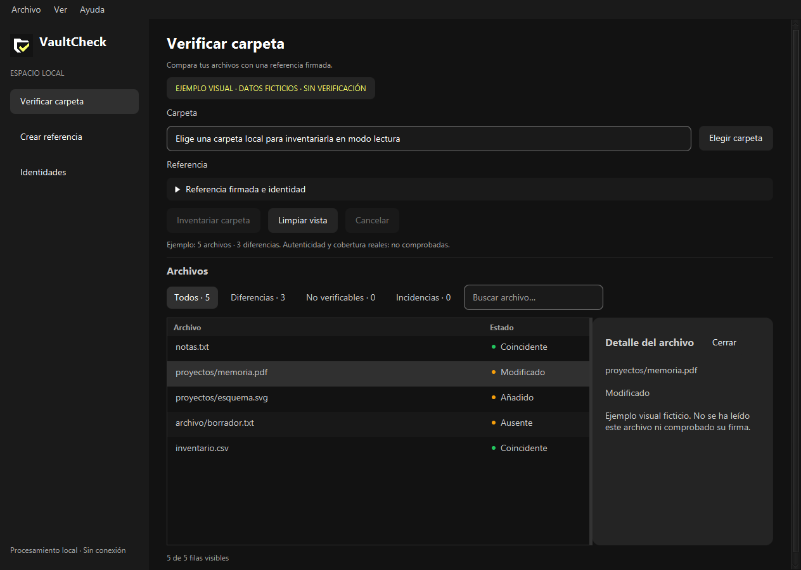

# VaultCheck

Utilidad de escritorio para Windows que compara archivos locales con una referencia firmada. Java 21, Spring Boot y JavaFX, sin servidor HTTP, cuentas ni nube.

**Vista previa en desarrollo.** Permite crear identidades cifradas, firmar referencias y verificar carpetas. La validación en un segundo equipo y la revisión previa a una distribución estable siguen pendientes. No es un antivirus ni sustituye una copia de seguridad.



## Funciones

- Identidades Ed25519 con clave privada cifrada mediante contraseña.
- Creación de referencias firmadas fuera de la carpeta examinada.
- Revisión de firma y aprobación explícita de la huella para la selección actual.
- Estados Coincidente, Modificado, Añadido, Ausente y No verificable.
- Filtros, búsqueda, inspector y cancelación cooperativa en segundo plano.
- Inventario de solo lectura: sin referencia, no declara integridad.

## Abrir en Windows

Extrae el paquete completo y abre `VaultCheck.exe`. Incluye Java y no requiere privilegios de administrador. No copies únicamente el EXE. Consulta la [guía del portátil](docs/laptop-test.md) y las [instrucciones de uso](docs/try-desktop.md).

Todavía no hay instalador ni firma de editor. El enlace de descarga se añadirá cuando exista una release real.

## Compilar y probar

Necesitas JDK 21 y JAVA_HOME apuntando al JDK. Maven Wrapper descarga Maven y dependencias en la primera ejecución.

```powershell
.\mvnw.cmd verify
java -jar .\target\vaultcheck-0.1.0-SNAPSHOT.jar --vaultcheck.ui=true
```

En una sesión gráfica de Windows:

```powershell
.\scripts\test-desktop.ps1
```

Las pruebas usan archivos sintéticos y directorios temporales propios. Cubren rutas adversarias, lectura nativa, comparación, firmas, claves cifradas y arranque. [Evidencia de validación](docs/validation.md).

Para generar el portátil, después de compilar y con VaultCheck cerrado:

```powershell
.\scripts\package-portable.ps1 -JdkPath $env:JAVA_HOME -Destination .\target\mi-portatil
```

El script rechaza destinos existentes. [Detalles del empaquetado](docs/portable-windows.md).

## Seguridad y límites

El lector nativo de Windows retiene handles durante la lectura y rechaza rutas no admitidas, reparse points y archivos con varios enlaces duros. Solo admite discos locales fijos: máximo 1.000 archivos, 4.096 visitas y 32 niveles. NAS y unidades de red no están soportados.

La referencia se autentica antes de interpretar sus entradas. Importar una clave no implica confiar en ella: la aprobación de huella es explícita y dura la selección actual. Las claves privadas se guardan con AES-256-GCM y derivación PBKDF2 en una carpeta restringida al usuario. No hay recuperación de una contraseña olvidada ni catálogo persistente.

Un recorrido no es una instantánea ni garantiza aislamiento frente a un administrador hostil u otros procesos del mismo usuario. Una firma válida no prueba que el original estuviera sano. La cobertura incompleta no equivale a ausencia de diferencias en toda la carpeta.

Consulta el [modelo de amenazas](docs/threat-model.md), el [lector Windows](docs/windows-handle-reader.md), las [identidades](docs/local-identities.md) y [SECURITY.md](SECURITY.md).

## Arquitectura y contribuciones

- `domain`: valores y reglas independientes del framework.
- `application`: creación, inventario y comparación autenticada.
- `infrastructure`: archivos nativos, firmas y almacenamiento cifrado.
- `desktop`: JavaFX y coordinación fuera del hilo gráfico.
- `docs`: requisitos, decisiones y validación.

Seguimos las siete fases del SDLC. Generar un EXE no completa puesta en marcha, mantenimiento ni retirada. [Hoja de ruta](docs/roadmap.md), [diseño visual](DESIGN.md) y [convenciones](CONTRIBUTING.md).

Código bajo [Apache-2.0](LICENSE). Dependencias y runtime conservan sus propias licencias. Antes de distribuir públicamente deben completarse sus avisos, el canal privado de seguridad y las validaciones pendientes.
